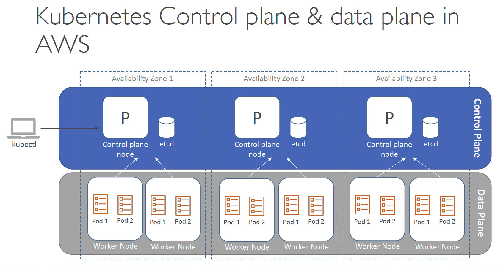
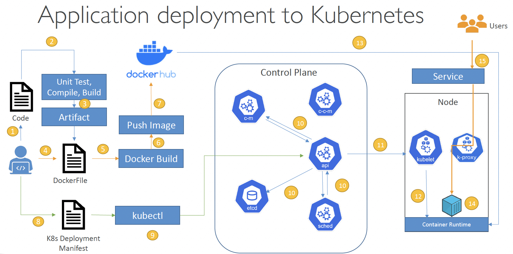
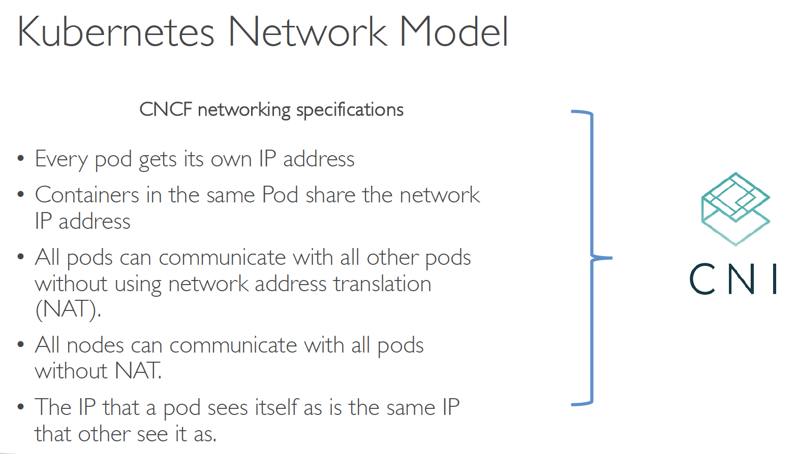
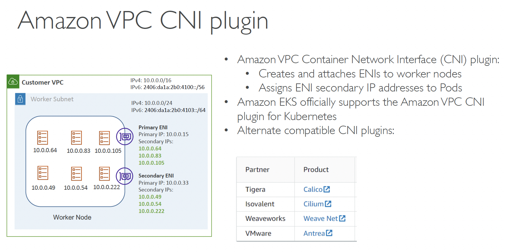

# ***(참고) `쿠버네테스` 관련 사항***

---

## **쿠버네테스 Control Plane과 Data Plane**


## **쿠버네테스에 애플리케이션을 배포하는 과정**


## **쿠버네테스 네트워크 모델**


## **`Amazon VPC CNI`**



---

# ***설치 순서***

---

## 1. **소스 코드 다운로드**

```bash
git clone https://github.com/shkim4u/ddd-inventory.git
cd ddd-inventory
````

---

## 2. **툴셋 설정 및 쿠버네테스 클러스터 생성 (Kind)**

```bash
make install-tools helm-add-repos
make create-cluster
```

---

## 3. **데이터베이스 배포 (`PostgreSQL`)**

```bash
make install-database-k8s
```

---

## 4. **RabbitMQ 배포 및 설처**

### 4.1. **RabbitMQ 배포**

```bash
make install-rabbitmq-k8s
```

### 4.2. **RabbitMQ 관리 UI 포트 포워딩**

```bash
make port-forward-rabbitmq-management-ui
```

### 4.3. **RabbitMQ Exchange 및 Queue 생성**

> 📌(참고)📌<br>
> 위에서 Port Forwarding을 수행한 터미널이 아닌 새로운 터미널을 열어서 아래 명령어를 수행합니다.

```bash
make download-rabbitmqadmin
make configure-rabbitmq-exchange-queue
```

### 4.4. **RabbitMQ 관리 UI 포트 포워딩 종료**

앞서 실행한 `make port-forward-rabbitmq-management-ui` 명령어를 종료합니다 (Ctrl + C).

---

## 5. **애플리케이션 빌드 및 배포**

### 5.1. **Avro 스키마 파일 Git Submodule 업데이트**

```bash
git submodule init
git submodule update
```

### 5.2. **애플리케이션 및 컨테이너 이미지 빌드**

```bash
make build-container-image
```

> 📌(참고)📌<br>
> 아래는 자바 컨테이너 이미지 다이어트를 위해 참고할 만한 문서입니다.<br>
> 1. [[Amazon Corretto OpenJDK를 사용한 Java 기반 애플리케이션 컨테이너 경량화 | AWS 기술 블로그]](https://aws.amazon.com/ko/blogs/tech/amazon-corretto-base-container-diet/)
> 2. [[jlink를 사용하는 Java 런타임 | Microsoft Learn]](https://learn.microsoft.com/ko-kr/java/openjdk/java-jlink-runtimes)
> 3. [[Slim Docker Images for Java - Piotr's TechBlog]](https://piotrminkowski.com/2023/11/07/slim-docker-images-for-java/)

### 5.3. **빌드된 컨테이너 이미지 노드에 적재***

```bash
make load-container-image
```

### 5.4. **인벤토리 서비스 애플리케이션 배포***

```bash
make deploy-application
``` 
